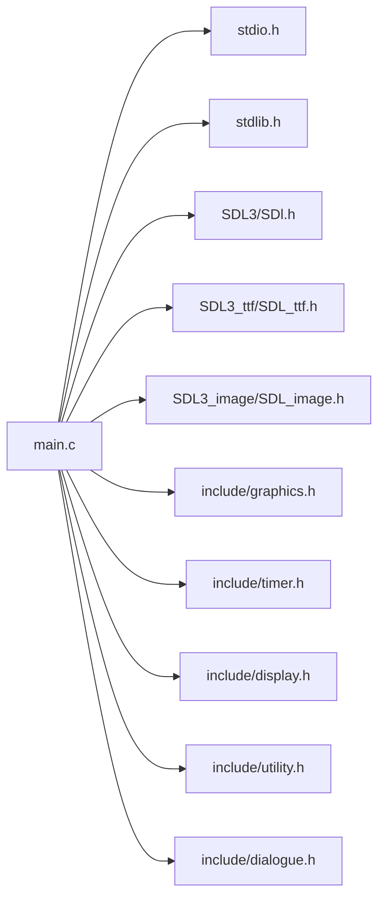

<a id="main_8c"></a>
# File main.c

![][C++]

**Location**: `main.c`


## Includes

* <stdio.h>
* <stdlib.h>
* <SDL3/SDl.h>
* <SDL3_ttf/SDL_ttf.h>
* <SDL3_image/SDL_image.h>
* include/graphics.h
* include/timer.h
* include/display.h
* include/utility.h
* include/dialogue.h





## Variables

<a id="main_8c_1adcfe377d610379465bf6294153c5d86d"></a>
### Variable TEXTPATH

![][public]

**Definition**: `main.c` (line 7)


```cpp
const char* TEXTPATH = "C:\\\\Engine\\\\FONTS\\\\8bitoperator_jve.ttf"
```


**Type**: const char *

<a id="main_8c_1a9eb8c8fa86d54544ffd79802430bd4d0"></a>
### Variable WHITE

![][public]

**Definition**: `main.c` (line 15)


```cpp
SDL_Color WHITE = {.r = 255, .g=255, .b=255, .a = 255}
```


**Type**: SDL_Color

<a id="main_8c_1a36aef2892254a6dcc6ea73de603def33"></a>
### Variable GOLD

![][public]

**Definition**: `main.c` (line 16)


```cpp
SDL_Color GOLD = {.r = 255, .g=215, .b=0, .a = 255}
```


**Type**: SDL_Color

<a id="main_8c_1a3e5a22bf8780b32759dcdaa0d341793e"></a>
### Variable RED

![][public]

**Definition**: `main.c` (line 17)


```cpp
SDL_Color RED = {.r = 255, .g=0, .b=0, .a = 255}
```


**Type**: SDL_Color

<a id="main_8c_1a8c1cc32ef749a9417e4cb0b0f0726463"></a>
### Variable BLACK

![][public]

**Definition**: `main.c` (line 18)


```cpp
SDL_Color BLACK = {.r = 0, .g=0, .b=0, .a = 255}
```


**Type**: SDL_Color

<a id="main_8c_1abf2a244c762f97da14da7f8c019d39a5"></a>
### Variable display

![][public]

**Definition**: `main.c` (line 20)


```cpp
ENGINE_Display* display
```


**Type**: ENGINE_Display *

<a id="main_8c_1a20514fad9a51b3bde3483d6d57b5b596"></a>
### Variable currentMenuOption

![][public]

**Definition**: `main.c` (line 21)


```cpp
int currentMenuOption = 0
```


**Type**: int

## Functions

<a id="main_8c_1a825b2eed45177024fa58382c1f1d6f98"></a>
### Function ENGINE\_SCENE\_INTRO

![][public]


```cpp
void ENGINE_SCENE_INTRO()
```


**Return type**: void

<a id="main_8c_1a5b27ec5f6d48cb5f4c480febc487eb6f"></a>
### Function ENGINE\_SCENE\_MENU

![][public]


```cpp
void ENGINE_SCENE_MENU()
```


**Return type**: void

<a id="main_8c_1a31dc589eccdcffd26d63264c4e60aa26"></a>
### Function ENGINE\_SCENE\_BEGINNING

![][public]


```cpp
void ENGINE_SCENE_BEGINNING()
```


**Return type**: void

<a id="main_8c_1a332169f0f57c5c3d31eb0e6112e5b84e"></a>
### Function ENGINE\_SCENE\_WORLD

![][public]


```cpp
void ENGINE_SCENE_WORLD()
```


**Return type**: void

<a id="main_8c_1a840291bc02cba5474a4cb46a9b9566fe"></a>
### Function main

![][public]


```cpp
int main(void)
```


**Parameters**:

* void

**Return type**: int

## Source


```cpp
#include <stdio.h>
#include <stdlib.h>
#include <SDL3/SDl.h>
#include <SDL3_ttf/SDL_ttf.h>
#include <SDL3_image/SDL_image.h>

const char* TEXTPATH = "C:\\\\Engine\\\\FONTS\\\\8bitoperator_jve.ttf";

#include "include/graphics.h"
#include "include/timer.h"
#include "include/display.h"
#include "include/utility.h"
#include "include/dialogue.h"

SDL_Color WHITE = {.r = 255, .g=255, .b=255, .a = 255};
SDL_Color GOLD = {.r = 255, .g=215, .b=0, .a = 255};
SDL_Color RED = {.r = 255, .g=0, .b=0, .a = 255};
SDL_Color BLACK = {.r = 0, .g=0, .b=0, .a = 255};

ENGINE_Display* display;
int currentMenuOption = 0;


/*
 * 1. Inits
 * 2. Logic
 * 3. Graphics creations
 * 5. Present
 * 6. Cleanup
 * 7. Timers/Events
 * 8. Delay
 */

void ENGINE_SCENE_INTRO() {
    bool running = true;
    const char* introMessage = "Made with SDL3";

    ENGINE_Graphic* introMessageGraphic = ENGINE_CreateGraphic();
    SDL_Event event;
    TTF_Font* mainFont = NULL;
    ENGINE_Timer* opacityTimer = NULL;
    ENGINE_Timer* animationFinishedTimer = NULL;

    opacityTimer = ENGINE_CreateTimer(60*0.12);
    int currentOpacity = 0;

    bool opacityAnimationFinished = false;
    animationFinishedTimer = ENGINE_CreateTimer(60*2);
    do {
        SDL_Color OPACITY_WHITE = WHITE;
        OPACITY_WHITE.a = currentOpacity;

        if(!SDL_GetRenderOutputSize(display->renderer, &display->w, &display->h)) {
            printf("Error retrieving renderer size: %s\n", SDL_GetError());
        }

        mainFont = TTF_OpenFont(TEXTPATH, display->h * 0.1);

        introMessageGraphic->textGraphic->text = TTF_CreateText(display->textEngine,mainFont, introMessage, strlen(introMessage));
        if(!introMessageGraphic->textGraphic->text) {
            printf("Error creating TTF_Text: %s\n", SDL_GetError());
        }

        if(!ENGINE_SetTextColor(introMessageGraphic->textGraphic->text, OPACITY_WHITE)) {
            printf("Error updating Text Color: %s\n", SDL_GetError());
        }

        if(!TTF_GetTextSize(introMessageGraphic->textGraphic->text, &introMessageGraphic->textGraphic->w, &introMessageGraphic->textGraphic->h)) {
            printf("Error retrieving text size: %s\n", SDL_GetError());
        }
        introMessageGraphic->rect.x = (display->w - introMessageGraphic->textGraphic->w) / 2;
        introMessageGraphic->rect.y = (display->h- introMessageGraphic->textGraphic->h) / 2;

        //Start Rendering

        if(!ENGINE_SetRendererColor(display->renderer, BLACK)) {
            printf("Error setting renderer draw color: %s\n", SDL_GetError());
        }

        SDL_RenderClear(display->renderer);
        SDL_SetRenderDrawBlendMode(display->renderer, SDL_BLENDMODE_BLEND);

        if(!ENGINE_SetRendererColor(display->renderer, OPACITY_WHITE)) {
            printf("Error setting renderer draw color: %s\n", SDL_GetError());
        };


        TTF_DrawRendererText(introMessageGraphic->textGraphic->text , introMessageGraphic->rect.x, introMessageGraphic->rect.y);

        SDL_SetRenderDrawBlendMode(display->renderer, SDL_BLENDMODE_NONE);

        SDL_RenderPresent(display->renderer);

        //Cleanup

        ENGINE_ClearGraphic(introMessageGraphic);
        TTF_CloseFont(mainFont);

        //Get Events
        while (SDL_PollEvent(&event)) {
            ;
        }
        if(opacityAnimationFinished) {
            if(ENGINE_CheckTimer(animationFinishedTimer)) {
                ENGINE_ResetTimer(animationFinishedTimer);
                running = false;
            } else {
                ENGINE_TickTimer(animationFinishedTimer);
            }
        }

        if(currentOpacity < 255) {
            if(ENGINE_CheckTimer(opacityTimer) && !opacityAnimationFinished) {
                ENGINE_ResetTimer(opacityTimer);
                currentOpacity += 15;
            } else {
                ENGINE_TickTimer(opacityTimer);
            }
        } else {
            opacityAnimationFinished = true;
        }


        SDL_Delay(16);

    } while(running);

    ENGINE_DestroyTimer(opacityTimer);
    ENGINE_DestroyTimer(animationFinishedTimer);
    ENGINE_DestroyGraphic(introMessageGraphic);

}

void ENGINE_SCENE_MENU() {
    bool running = true;
    const char* gameTitle = "Medieval Game";
    const char* menuOptions[3] = {"Continue", "Start New", "Exit"};
    int pizzaAngle = 0;

    ENGINE_Graphic* menuOptionGraphics[3] = {ENGINE_CreateGraphic(), ENGINE_CreateGraphic(), ENGINE_CreateGraphic()};
    ENGINE_Graphic* gameAreaGraphic = ENGINE_CreateGraphic();
    ENGINE_Graphic* gameTitleGraphic = ENGINE_CreateGraphic();
    ENGINE_Graphic* optionPizzaGraphic = ENGINE_CreateGraphic();
    SDL_Event event;
    TTF_Font* mainFont = NULL;
    ENGINE_Timer* keyDebounceTimer = ENGINE_CreateTimer(60*0.125);
    do {

        if(!SDL_GetRenderOutputSize(display->renderer, &display->w, &display->h)) {
            printf("Error retrieving renderer size: %s\n", SDL_GetError());
        }

        gameAreaGraphic->rect.w = display->h / 1.2f;
        gameAreaGraphic->rect.h = display->h / 1.2f;

        gameAreaGraphic->rect.x = (int) (display->w - gameAreaGraphic->rect.w) / 2;
        gameAreaGraphic->rect.y = (int) (display->h - gameAreaGraphic->rect.h) / 2;

        gameTitleGraphic->rect.w = (int) display->h / 1.2;
        gameTitleGraphic->rect.h = (int) (display->h - gameAreaGraphic->rect.h) / 2;

        gameTitleGraphic->rect.x = (int) (display->w - gameAreaGraphic->rect.w) / 2;
        gameTitleGraphic->rect.y = 0;

        mainFont = TTF_OpenFont(TEXTPATH, gameTitleGraphic->rect.h / 1);

        gameTitleGraphic->textGraphic->text = TTF_CreateText(display->textEngine,mainFont, gameTitle, strlen(gameTitle));
        if(!gameTitleGraphic->textGraphic->text) {
            printf("Error creating TTF_Text: %s\n", SDL_GetError());
        }

        if(!TTF_GetTextSize(gameTitleGraphic->textGraphic->text, &gameTitleGraphic->textGraphic->w, &gameTitleGraphic->textGraphic->h)) {
            printf("Error retrieving text size: %s\n", SDL_GetError());
        }

        for(int i = 0; i < 3; i++) {
            menuOptionGraphics[i]->textGraphic->text = TTF_CreateText(display->textEngine,mainFont, menuOptions[i], strlen(menuOptions[i]));
            if(!menuOptionGraphics[i]->textGraphic->text) {
                printf("Error creating TTF_Text: %s\n", SDL_GetError());
            }

            if(!TTF_GetTextSize(menuOptionGraphics[i]->textGraphic->text, &menuOptionGraphics[i]->textGraphic->w, &menuOptionGraphics[i]->textGraphic->h)) {
                printf("Error retrieving text size: %s\n", SDL_GetError());
            }


            menuOptionGraphics[i]->rect.w = (int) display->h / 1.2f;
            menuOptionGraphics[i]->rect.h = (int) (display->h - menuOptionGraphics[i]->rect.h) / 2;

            menuOptionGraphics[i]->rect.x = (int) (  display->w - gameAreaGraphic->rect.w) / 2 + (menuOptionGraphics[i]->rect.w - menuOptionGraphics[i]->textGraphic->w) / 2;
            menuOptionGraphics[i]->rect.y = (int) (display->h - gameAreaGraphic->rect.h) * (i+1);

            if(i == currentMenuOption) {
                optionPizzaGraphic->rect.w = display->h / 10;
                optionPizzaGraphic->rect.h = display->h / 10;
                optionPizzaGraphic->rect.y = menuOptionGraphics[i]->rect.y;
                optionPizzaGraphic->rect.x = menuOptionGraphics[i]->rect.x + menuOptionGraphics[i]->textGraphic->w;
                if(!ENGINE_SetTextColor(menuOptionGraphics[i]->textGraphic->text, RED)) {
                    printf("Error setting text color: %s\n", SDL_GetError());
                }
            }

        }

        //Start Rendering

        if(!ENGINE_SetRendererColor(display->renderer, BLACK)) {
            printf("Error setting renderer draw color: %s\n", SDL_GetError());
        }

        SDL_RenderClear(display->renderer);

        if(!ENGINE_SetRendererColor(display->renderer, WHITE)) {
            printf("Error setting renderer draw color: %s\n", SDL_GetError());
        }

        SDL_RenderRect(display->renderer, &gameAreaGraphic->rect);

        if(!TTF_DrawRendererText(gameTitleGraphic->textGraphic->text , gameTitleGraphic->rect.x + (gameTitleGraphic->rect.w / 2) - gameTitleGraphic->textGraphic->w / 2, gameTitleGraphic->rect.y)) {
            printf("Error drawing text: %s\n", SDL_GetError());
        }

        //SDL_RenderTextureRotated(display->renderer, optionPizzaGraphic->texture,NULL, &optionPizzaGraphic->rect, pizzaAngle, NULL, 0);

        for(int i = 0; i < 3; i++) {
            //SDL_RenderRect(display->renderer, &menuOptionGraphics[i]->rect);
            if(!TTF_DrawRendererText(menuOptionGraphics[i]->textGraphic->text , menuOptionGraphics[i]->rect.x, menuOptionGraphics[i]->rect.y)) {
                printf("Error drawing text: %s\n", SDL_GetError());
            }
        }

        SDL_RenderPresent(display->renderer);

        //Cleanup

        ENGINE_ClearGraphic(gameAreaGraphic);
        ENGINE_ClearGraphic(gameTitleGraphic);

        for( int i = 0; i< 3; i++) {
            ENGINE_ClearGraphic(menuOptionGraphics[i]);
        }

        TTF_CloseFont(mainFont);

        //Get Events
        if(ENGINE_CheckTimer(keyDebounceTimer)) {
            if(pizzaAngle >= 360) {
                pizzaAngle = -360;
            }
            pizzaAngle += 3;
            //printf("%d\n", pizzaAngle);
        }
        while (SDL_PollEvent(&event)) {
            if(event.key.key == SDLK_RETURN) {
                event.key.key = 0;
                running = false;
            }
            if(ENGINE_CheckTimer(keyDebounceTimer)) {
                ENGINE_ResetTimer(keyDebounceTimer);
                if (event.key.key == SDLK_UP) {
                    if (currentMenuOption > 0) {
                        currentMenuOption -= 1;
                    }
                }
                if (event.key.key == SDLK_DOWN) {
                    if (currentMenuOption < 2) {
                        currentMenuOption += 1;
                    }
                }
            }
        }

        ENGINE_TickTimer(keyDebounceTimer);

        SDL_Delay(16);

    } while(running);
    ENGINE_DestroyTimer(keyDebounceTimer);
    ENGINE_DestroyGraphic(gameAreaGraphic);
    ENGINE_DestroyGraphic(gameTitleGraphic);
    for( int i = 0; i< 3; i++) {
        ENGINE_DestroyGraphic(menuOptionGraphics[i]);
    }

}

void ENGINE_SCENE_BEGINNING() {
    bool running = true;

    const char* nameMessage = "What is your name?";
    char inputName[15] = "";
    char charToAdd;
    ENGINE_Graphic* nameMessageGraphic = ENGINE_CreateGraphic();
    ENGINE_Graphic* nameInputGraphic = ENGINE_CreateGraphic();
    SDL_Event event;
    TTF_Font* mainFont = NULL;
    ENGINE_Timer* opacityTimer = NULL;
    ENGINE_Timer* animationFinishedTimer = NULL;

    do {

        if(!SDL_GetRenderOutputSize(display->renderer, &display->w, &display->h)) {
            printf("Error retrieving renderer size: %s\n", SDL_GetError());
        }

        int len = strlen(inputName);
        if(charToAdd == SDLK_BACKSPACE) {

        }
        if(len < sizeof(inputName) - 1 && charToAdd != ' ' && charToAdd != SDLK_BACKSPACE) {
            inputName[len] = charToAdd;
            inputName[len + 1] = '\0';
        }
        charToAdd = ' ';

        mainFont = TTF_OpenFont(TEXTPATH, display->h * 0.05);

        nameMessageGraphic->textGraphic->text = TTF_CreateText(display->textEngine,mainFont, nameMessage, strlen(nameMessage));
        if(!nameMessageGraphic->textGraphic->text) {
            printf("Error creating TTF_Text: %s\n", SDL_GetError());
        }

        if(!TTF_GetTextSize(nameMessageGraphic->textGraphic->text, &nameMessageGraphic->textGraphic->w, &nameMessageGraphic->textGraphic->h)) {
            printf("Error retrieving text size: %s\n", SDL_GetError());
        }
        nameMessageGraphic->rect.x = (display->w - nameMessageGraphic->textGraphic->w) / 2;
        nameMessageGraphic->rect.y = (display->h- nameMessageGraphic->textGraphic->h) / 6;


        nameInputGraphic->textGraphic->text = TTF_CreateText(display->textEngine,mainFont, inputName, strlen(inputName));
        if(!nameInputGraphic->textGraphic->text) {
            printf("Error creating TTF_Text: %s\n", SDL_GetError());
        }

        if(!TTF_GetTextSize(nameInputGraphic->textGraphic->text, &nameInputGraphic->textGraphic->w, &nameInputGraphic->textGraphic->h)) {
            printf("Error retrieving text size: %s\n", SDL_GetError());
        }
        nameInputGraphic->rect.x = (display->w - nameInputGraphic->textGraphic->w) / 2;
        nameInputGraphic->rect.y = (display->h- nameInputGraphic->textGraphic->h) / 2;

        //Start Rendering

        if(!ENGINE_SetRendererColor(display->renderer, BLACK)) {
            printf("Error setting renderer draw color: %s\n", SDL_GetError());
        }

        SDL_RenderClear(display->renderer);
        SDL_SetRenderDrawBlendMode(display->renderer, SDL_BLENDMODE_BLEND);

        if(!ENGINE_SetRendererColor(display->renderer, WHITE)) {
            printf("Error setting renderer draw color: %s\n", SDL_GetError());
        };

        TTF_DrawRendererText(nameMessageGraphic->textGraphic->text , nameMessageGraphic->rect.x, nameMessageGraphic->rect.y);

        TTF_DrawRendererText(nameInputGraphic->textGraphic->text , nameInputGraphic->rect.x, nameInputGraphic->rect.y);

        SDL_SetRenderDrawBlendMode(display->renderer, SDL_BLENDMODE_NONE);

        SDL_RenderPresent(display->renderer);

        //Cleanup

        ENGINE_ClearGraphic(nameMessageGraphic);
        TTF_CloseFont(mainFont);

        //Get Events
        while (SDL_PollEvent(&event)) {
            if(event.key.type == SDL_EVENT_KEY_DOWN){
                charToAdd = event.key.key;
                break;
            }
        }


        SDL_Delay(16);

    } while(running);

    ENGINE_DestroyTimer(opacityTimer);
    ENGINE_DestroyTimer(animationFinishedTimer);
    ENGINE_DestroyGraphic(nameMessageGraphic);

}

void ENGINE_SCENE_WORLD() {
    bool running = true;
    const char* gameTitle = "Medieval Game";

    ENGINE_Graphic* menuOptionGraphics[3] = {ENGINE_CreateGraphic(), ENGINE_CreateGraphic(), ENGINE_CreateGraphic()};
    ENGINE_Graphic* gameAreaGraphic = ENGINE_CreateGraphic();
    ENGINE_Graphic* gameTitleGraphic = ENGINE_CreateGraphic();
    SDL_Event event;
    TTF_Font* mainFont = NULL;
    ENGINE_Timer* keyDebounceTimer = ENGINE_CreateTimer(60*0.125);
    ENGINE_Dialogue* testDialogue = ENGINE_CreateDialogue();
    const char* options[4] = {"Option 1", "Option 2", "Option 3", "Option 4"};
    do {

        if(!SDL_GetRenderOutputSize(display->renderer, &display->w, &display->h)) {
            printf("Error retrieving renderer size: %s\n", SDL_GetError());
        }


        gameAreaGraphic->rect.w = display->w / 1.2f;
        gameAreaGraphic->rect.h = display->h / 1.2f;

        gameAreaGraphic->rect.x = (int) (display->w - gameAreaGraphic->rect.w) / 2;
        gameAreaGraphic->rect.y = (int) (display->h - gameAreaGraphic->rect.h) / 2;

        gameTitleGraphic->rect.w = gameAreaGraphic->rect.w;
        gameTitleGraphic->rect.h = (int) (display->h - gameAreaGraphic->rect.h) / 2;

        gameTitleGraphic->rect.x = (int) (display->w - gameAreaGraphic->rect.w) / 2;
        gameTitleGraphic->rect.y = 0;


        mainFont = TTF_OpenFont(TEXTPATH, gameTitleGraphic->rect.h / 1);

        gameTitleGraphic->textGraphic->text = TTF_CreateText(display->textEngine,mainFont, gameTitle, strlen(gameTitle));
        if(!gameTitleGraphic->textGraphic->text) {
            printf("Error creating TTF_Text: %s\n", SDL_GetError());
        }

        if(!TTF_GetTextSize(gameTitleGraphic->textGraphic->text, &gameTitleGraphic->textGraphic->w, &gameTitleGraphic->textGraphic->h)) {
            printf("Error retrieving text size: %s\n", SDL_GetError());
        }


        //Start Rendering

        if(!ENGINE_SetRendererColor(display->renderer, BLACK)) {
            printf("Error setting renderer draw color: %s\n", SDL_GetError());
        }

        SDL_RenderClear(display->renderer);

        if(!ENGINE_SetRendererColor(display->renderer, WHITE)) {
            printf("Error setting renderer draw color: %s\n", SDL_GetError());
        }

        //SDL_RenderRect(display->renderer, &gameTitleGraphic->rect);
        SDL_RenderRect(display->renderer, &gameAreaGraphic->rect);

        if(!TTF_DrawRendererText(gameTitleGraphic->textGraphic->text , gameTitleGraphic->rect.x + (gameTitleGraphic->rect.w / 2) - gameTitleGraphic->textGraphic->w / 2, gameTitleGraphic->rect.y)) {
            printf("Error drawing text: %s\n", SDL_GetError());
        }

        ENGINE_UpdateDialogue(display, testDialogue, gameAreaGraphic->rect, options);

        SDL_RenderPresent(display->renderer);

        //Cleanup

        ENGINE_ClearGraphic(gameAreaGraphic);
        ENGINE_ClearGraphic(gameTitleGraphic);
        ENGINE_ClearDialogue(testDialogue);

        for( int i = 0; i< 3; i++) {
            ENGINE_ClearGraphic(menuOptionGraphics[i]);
        }

        TTF_CloseFont(mainFont);

        //Get Events
        while (SDL_PollEvent(&event)) {
            ;
        }

        ENGINE_TickTimer(keyDebounceTimer);

        SDL_Delay(16);

    } while(running);
    ENGINE_DestroyTimer(keyDebounceTimer);
    ENGINE_DestroyGraphic(gameAreaGraphic);
    ENGINE_DestroyGraphic(gameTitleGraphic);
    for( int i = 0; i< 3; i++) {
        ENGINE_DestroyGraphic(menuOptionGraphics[i]);
    }

}

int main(void) {

    if(!SDL_Init(SDL_INIT_EVENTS)) {
        printf("Error initializing SDL: %s\n", SDL_GetError());
    }

    if(!TTF_Init()) {
        printf("Error initializing SDL_TTF: %s\n", SDL_GetError());
    }

    display = ENGINE_CreateDisplay();

    display->window = SDL_CreateWindow("Medieval Game", 800, 600, SDL_WINDOW_RESIZABLE);
    if(!display->window) {
        printf("Error creating SDL window: %s\n", SDL_GetError());
    }

    display->renderer = SDL_CreateRenderer(display->window, NULL);
    if(!display->renderer) {
        printf("Error creating SDL renderer: %s\n", SDL_GetError());
    }

    display->textEngine = TTF_CreateRendererTextEngine(display->renderer);
    if(!display->textEngine) {
        printf("Error creating SDL text engine: %s\n", SDL_GetError());
    }

    //ENGINE_SCENE_INTRO();
    ENGINE_SCENE_MENU();
    //ENGINE_SCENE_BEGINNING();
    ENGINE_SCENE_WORLD();
    SDL_Quit();

    system("pause");
    return 0;
}
```


[C++]: https://img.shields.io/badge/language-C%2B%2B-blue (C++)
[public]: https://img.shields.io/badge/-public-brightgreen (public)